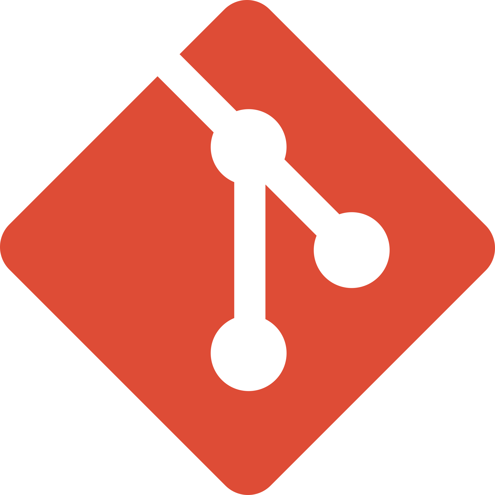
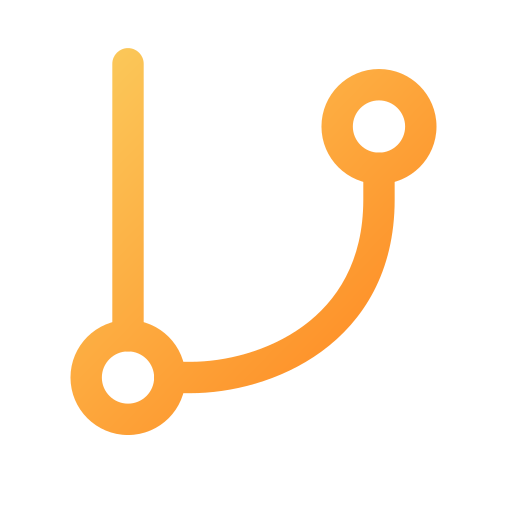

# Git 버전관리시스템 사용방법
#  Git 소개

Git은 분산 버전관리시스템(DVCS)으로 로컬 저장소(내 PC)와 원격 저장소(GitHub, GitLab)로 구성되어 있습니다.

개발자를 위한 전용 클라우드 서비스 및 타임머신인 셈입니다.

---

#  Git 초기 설정

Git을 사용하기 위해서는 user.name과 user.email을 먼저 설정해 줘야 합니다.

협업 시 누가 commit을 했는지 알기 위해서 위 정보를 기입해야 합니다.

```
// 터미널에서 아래 명령어를 차례대로 실행
// 전역(Global) 설정: 이 컴퓨터의 모든 프로젝트에 적용

git config --global user.name "내 이름"
git config --global user.email "내 이메일"

// 설정 확인 (q 누르면 종료)
git config --list
```

---

#  Git 명령어

git에는 세 가지 섹션이 존재합니다.

1. Working Directory: 코드를 짜고 수정하는 로컬 저장소의 단계입니다.
2. Staging Area: 커밋할 파일들을 담아두는 공간입니다.
3. Repository: git commit을 통해서 스테이징 영역에 있던 파일이 영구적으로 기록되는 저장소 공간입니다.

### git add

작업한 결과를 원격 저장소에 올리기 전 스테이징 영역에 올리는 단계입니다.

### git commit

commit은 로컬 저장소에서 기록을 남기는 것(`main`으로 표시됨)
저장(ctrl+S)와 유사한 기능이라고 보면 됩니다.

- commit은 ‘의미있는 단위’로: 하나의 논리적인 단위가 끝났을 때(기능 구현, 버그 수정 등) 하는 것이 좋습니다.

### git push

원격 저장소에 지금까지 로컬 저장소에 commit한 내용을 업로드 하는 것(`origin/main`으로 표시됨)

### git pull

원격 저장소에 있는 최신 변경사항을 로컬 저장소로 가져와 합치는 것(merge+fetch가 합쳐진 기능)

- pull은 작업 시작 전에: 협업 중이라면 작업 시작 전에 git pull을 해야 충돌(conflict)을 줄일 수 있습니다.

---

##  브랜치(Branch)

| **이름** | **정체** | **위치** | **의미** |
| --- | --- | --- | --- |
| **`main`** | 로컬 브랜치 | 내 PC | 로컬 저장소에서 코드를 수정하고 `commit`을 남기는 곳입니다. |
| **`origin`** | 원격 저장소 별명 | 클라우드(ex. github) | 원격 저장소의 URL 대신 사용하는 **별명**입니다. |
| **`origin/main`** | 원격 추적 브랜치 | 내 PC | "내가 마지막으로 확인했을 때 깃허브의 `main`은 여기까지였어"라고 적어둔 **책갈피**입니다. |